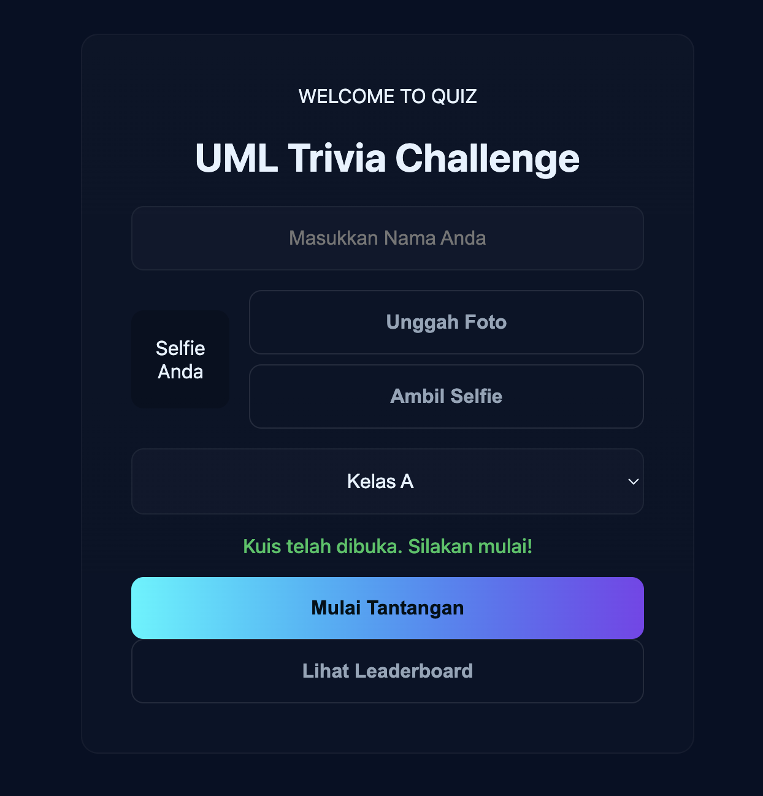
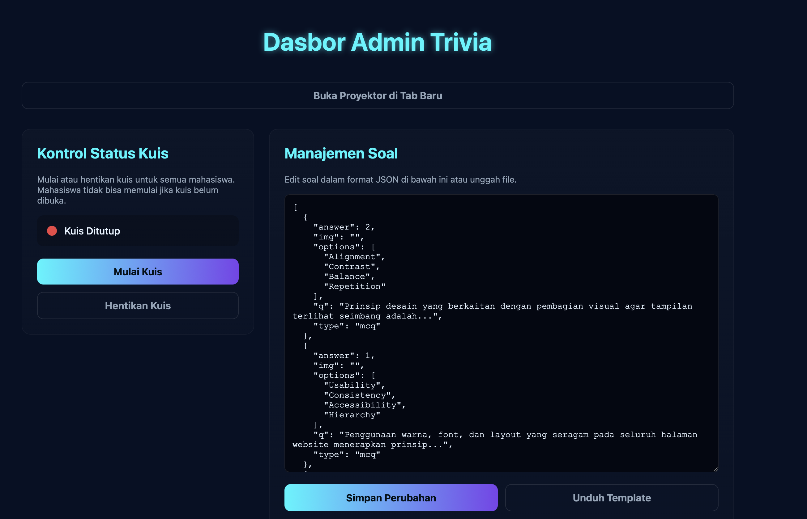
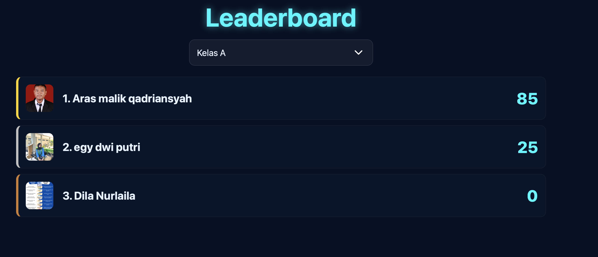

# 🎮 Trivia Games Web Application

A simple web-based trivia quiz game built using **JavaScript** and **Firebase Realtime Database**.  
This application allows players to answer trivia questions and automatically records their scores on a real-time leaderboard.

The project is deployed using **GitHub Pages**, allowing users to access the game directly through a web browser without installing any additional software.

---

## 🚀 Live Demo

You can play the game here:

[https://dilanurlaila.github.io/trivia-games](https://dilanurlaila.github.io/trivia-game-/)

---

## 📌 Features

- 🎯 Interactive trivia quiz gameplay  
- 🧠 Multiple choice question system  
- 📊 Real-time leaderboard using Firebase  
- 👤 Admin dashboard for managing questions  
- 🔄 Reset leaderboard feature  
- ✏️ Add or update trivia questions  
- 📱 Simple and responsive user interface  

---

## 🛠 Technologies Used

This project was developed using the following technologies:

- HTML  
- CSS  
- JavaScript  
- :contentReference[oaicite:1]{index=1} Realtime Database  
- :contentReference[oaicite:2]{index=2} for version control  
- :contentReference[oaicite:3]{index=3} for deployment  

---

## 📂 Project Structure

```
trivia-games/
│
├── index.html          # Main game interface
├── main.js             # Game logic and Firebase integration
├── style.css           # Application styling
│
├── admin/              # Admin dashboard
│   └── admin.html
│
└── assets/             # Images, icons, and other resources
```

---

## ⚙️ How to Run the Project

### 1️⃣ Run Locally

1. Clone or download this repository

```
git clone https://github.com/dilanurlaila/trivia-games.git
```

2. Open the project folder

3. Run the application by opening:

```
index.html
```

in your web browser.

--

## 🔥 Firebase Integration

This application uses **Firebase Realtime Database** to store and manage data such as:

- trivia questions  
- player scores  
- leaderboard rankings  

Firebase enables **real-time data synchronization**, allowing leaderboard updates to appear instantly when a player finishes the quiz.

---

## 🛠 Admin Dashboard

The admin dashboard allows administrators to manage the trivia game content.

Admin features include:

- Reset leaderboard  
- Display leaderboard results  
- Add new trivia questions  
- Update existing questions  

For simplicity, the admin panel currently **does not implement authentication**, meaning it is intended for controlled or educational environments.

---

## 📸 Screenshots

### Game Interface





---

## 📜 License

This project is licensed under the **MIT License**.

You are free to use, modify, and distribute this project for educational purposes.

---

## 👩‍💻 Author

**Dila Nurlaila**  
Information Systems

---

⭐ If you find this project helpful, feel free to give it a **star on GitHub**.
